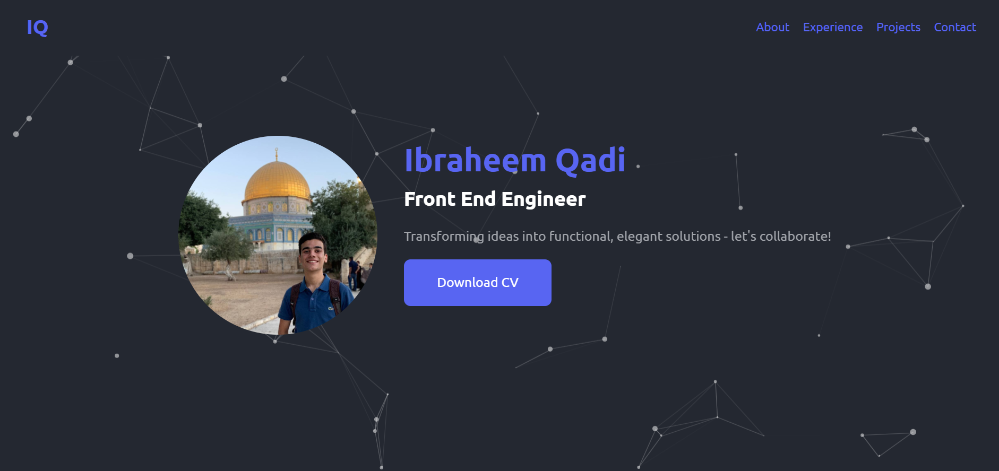

# Ibraheem's Portfolio

My personal portfolio which features my experience and some of my projects as well as my CV and technical skills.

## Demo

Here's the [website](https://ibraheemqadi.github.io/Portfolio/) for you to explore further.

## Built with

    

## Run Locally

Clone the project

```bash
  git clone https://github.com/IbraheemQadi/Portfolio.git
```

Go to the project directory

```bash
  cd Portfolio
```

Install dependencies

```bash
  npm install
```

Start the server

```bash
  npm run dev
```

## License

This project is licensed under the [MIT](https://choosealicense.com/licenses/mit/).
